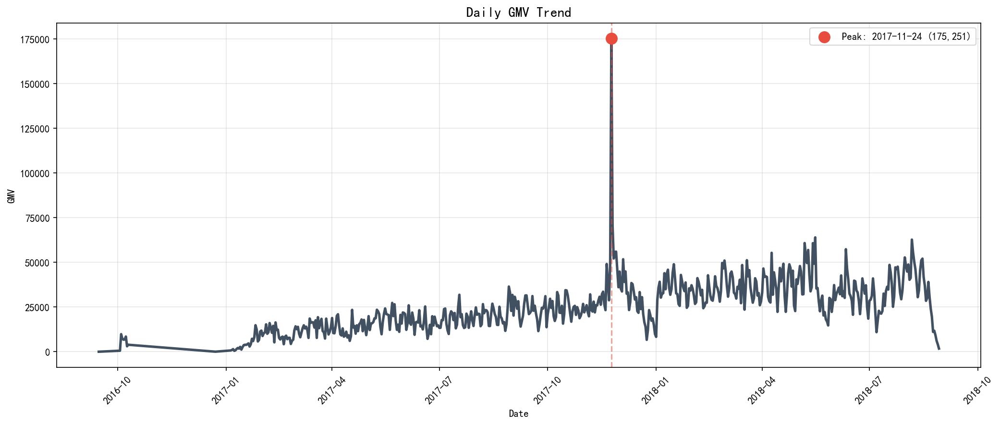
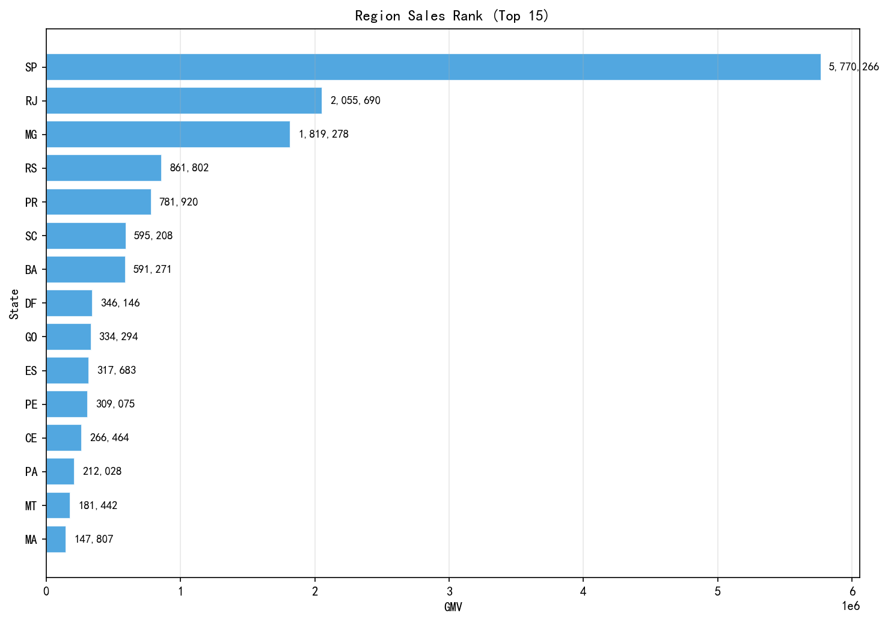
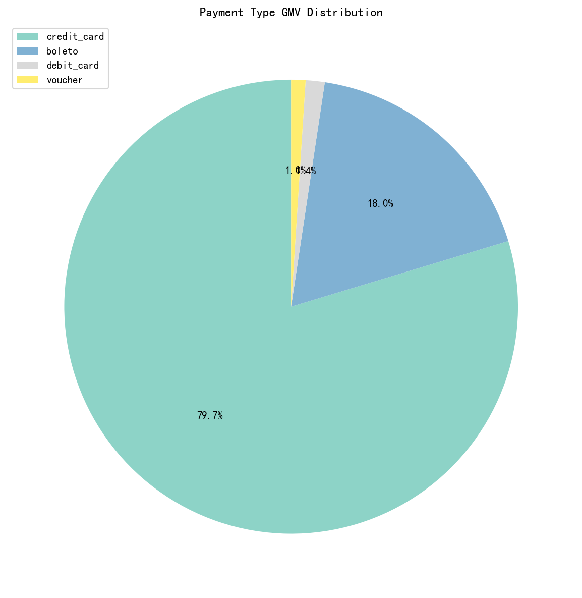

# 电商离线数仓与经营分析看板

---

## 一、项目概述

基于 Python + Hive + Spark SQL 在 WSL2 + Docker 上搭建电商离线数仓，完成从 Olist 原始数据到 10 张经营分析图表的全链路，并输出分析结论与未来建议。

### 项目背景与目标

- **数据源**：Olist 电商公开数据集（订单、明细、支付、客户、商品等）[Brazilian E-Commerce Public Dataset by Olist](https://www.kaggle.com/datasets/olistbr/brazilian-ecommerce)
- **目标**：搭建 ODS/DWD/DWS/ADS 分层数仓，产出经营分析看板，支撑业务解读
- **周期**：5天，涵盖环境搭建、数据建模、指标开发、可视化及文档

### 技术栈

| 类别 | 技术 |
|------|------|
| 环境 | Windows + WSL2 + Docker |
| 存储与计算 | Hadoop HDFS、Hive（Metastore + HiveServer2）、Spark |
| 语言 | SQL（Hive）、Python（PySpark、pandas、matplotlib） |
| 脚本 | `jobs/spark_ads_job.py`、`src/ads_visualization.ipynb` |

---

## 二、架构设计

### 2.1 数仓分层

| 分层 | 职责 | 落地 |
|------|------|------|
| ODS | 原始落地层，保留源数据 | HDFS `/dw/ods/olist/*` + Hive 外部表（9 张） |
| DWD | 明细规范层，主键关联、轻度清洗 | `dwd_trade_detail`（粒度 order_id + order_item_id） |
| DWS | 主题汇总层，按维度预聚合 | 6 张：gmv_day、region_day、city_day、payment_type_day、product_sales、user_order_summary |
| ADS | 应用指标层，面向看板与导出 | 10 张表，经 Spark 导出 CSV → 可视化 |

### 2.2 数据流

```
ODS(orders/order_items/order_payments/customers/products/category)
    ↓ 支付按 order_id 聚合、6 表 JOIN、衍生字段
DWD(dwd_trade_detail)
    ↓ 订单级去重、按主题聚合、filter: delivered
DWS(6 张主题表)
    ↓ ROW_NUMBER、月聚合、占比计算
ADS(10 张表)
    ↓ Spark 导出 CSV
可视化(10 张图表 + 分析结论)
```

### 2.3 核心表与指标

**DWS 主题表**：dws_gmv_day、dws_region_day、dws_city_day、dws_payment_type_day、dws_product_sales、dws_user_order_summary

**ADS 输出**：ads_gmv_trend、ads_gmv_month、ads_region_sales_rank、ads_region_sales_month、ads_city_sales、ads_category_topn、ads_product_topn、ads_payment_dist、ads_payment_type_month、ads_order_status_day

**指标口径**：GMV = payment_value_sum（仅 delivered），订单数 = COUNT(DISTINCT order_id)

---

## 三、执行流程与关键产出

### Day1–Day2：环境与 ODS

- Docker 部署 NameNode/DataNode/Postgres/Hive/Spark
- HDFS、Hive、Spark 最小验证
- Olist 数据探索与 ODS 外部表（9 张）落地

### Day3：DWD 层

- 设计 `dwd_trade_detail` 宽表
- **关键处理**：order_payments 一单多笔，先按 order_id 聚合再 JOIN，避免明细倍增
- 质量校验：主键唯一、空值、金额、关联、支付覆盖率

### Day4：DWS 层

- 从 ADS 目标反推主题粒度
- 6 张 DWS 表建表与 INSERT
- **关键处理**：payment_value_sum 在 DWD 按订单重复，聚合前按 order_id 去重

- 10 张 ADS 表（含月表、支付分布、类目/城市 TopN、异常订单监控）
- `spark_ads_job.py` 批量导出 CSV
- **性能对比**：小表场景 Hive 更快（~1.2s），Spark 有 JVM 冷启动（~4–5s）

### Day5：可视化

- `ads_visualization.ipynb` 绘制 10 张经营分析图
- 每图附带分析、结论、未来建议，形成经营分析闭环

---

## 四、可视化看板

| 序号 | 图表 | 说明 |
|------|------|------|
| 01 | 日 GMV 趋势 | 折线图，红点标注峰值日 2017-11-24 |
| 02 | 月 GMV + 环比 | 柱状图 + 折线图，自 2017-01 起 |
| 03 | 区域销售排行 | Top15 州，柱右侧显示 GMV |
| 04 | 类目销售排行 | Top15 类目 |
| 05 | 城市销售排行 | Top15 城市 |
| 06 | 支付方式占比 | 饼图，信用卡 ~79.7% |
| 07 | 类目 Top3 商品 | 按类目着色 |
| 08 | 异常订单监控 | 按月聚合 canceled/unavailable |
| 09 | 区域月度 GMV | 堆叠面积图 |
| 10 | 支付月度占比 | 100% 堆叠柱状图 |

### 图表预览






## 五、踩坑与解决方案

### 5.1 Hive 连接失败

- **现象**：beeline 连接 `jdbc:hive2://localhost:10000` 报 Connection refused
- **原因**：metastore URI 被解析为带下划线主机名，URI 非法
- **处理**：调整 docker-compose 中 Hive 网络与主机命名，修正 metastore 配置

### 5.2 ODS 表查询为 0

- **现象**：建表成功但 `SELECT *` 无数据
- **原因**：表 `LOCATION` 与实际上传路径不一致
- **处理**：统一指向 `/dw/ods/olist/<表名>` 实际路径

### 5.3 DWD 明细倍增

- **现象**：dwd_trade_detail 行数远高于 ods_order_items
- **原因**：order_payments 一单多笔，直接 JOIN 导致重复
- **处理**：先按 order_id 聚合 sum(payment_value)、min(payment_type)，再 JOIN

### 5.4 Hive 写入 Permission denied

- **现象**：INSERT OVERWRITE 报 Permission denied
- **原因**：HDFS 目录由 root 创建，hive 用户无写权限
- **处理**：`hdfs dfs -chown -R hive:hive /dw/dwd/olist`

### 5.5 DWS GMV 口径不一致

- **现象**：DWS GMV 与业务预期偏大
- **原因**：DWD 中 payment_value_sum 按订单重复，直接 SUM 会重复累加
- **处理**：先按 order_id 取 max 或去重后再 sum
