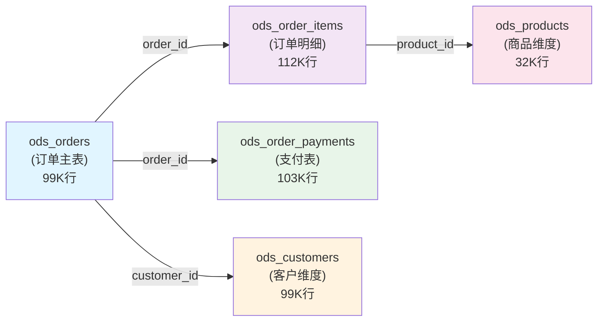

# ODS 数据加载指南

## 📋 概述

本文档说明如何将 Olist 原始数据加载到数据仓库的 **ODS (原始数据层)**。

### ODS 层的特点

| 特点 | 说明 |
|------|------|
| **不做清洗** | 保留原始数据格式和内容 |
| **外部表** | 使用 EXTERNAL TABLE，数据存储在 HDFS |
| **结构简单** | 直接映射 CSV 文件的字段 |
| **时间字段** | 保持字符串格式，便于统一处理 |

---

## 🗂️ 文件位置说明

| 文件 | 位置 | 用途 |
|------|------|------|
| **ODS DDL** | `sql/ods_olist.sql` | 定义 5 张 ODS 表的结构 |
| **Python 加载脚本** | `src/load_to_ods.py` | 可视化加载工具 |
| **Shell 加载脚本** | `scripts/load_olist_to_hdfs.sh` | 快速上传脚本 |
| **原始数据** | `data/raw/public/olist/*.csv` | 源数据文件 |

---

## 📊 ODS 表设计

### 5 张 ODS 表结构

#### 1. ODS_ORDERS - 订单主表

```sql
CREATE EXTERNAL TABLE ods_orders (
    order_id STRING,                      -- 订单ID (主键)
    customer_id STRING,                   -- 客户ID
    order_status STRING,                  -- 订单状态
    order_purchase_timestamp STRING,      -- 下单时间 ⭐ 关键时间字段
    order_approved_at STRING,             -- 批准时间
    order_delivered_carrier_date STRING,  -- 承运商交付时间
    order_delivered_customer_date STRING, -- 客户签收时间
    order_estimated_delivery_date STRING  -- 预计送达时间
)
LOCATION '/dw/ods/olist/orders'
```

- **行数**: ~99,441
- **关键字段**: order_id (主键), customer_id (外键), order_purchase_timestamp (时间)
- **用途**: 订单主线

#### 2. ODS_ORDER_ITEMS - 订单明细表

```sql
CREATE EXTERNAL TABLE ods_order_items (
    order_id STRING,              -- 订单ID (外键)
    order_item_id INT,            -- 订单内序号 (与order_id组成候选主键)
    product_id STRING,            -- 商品ID
    seller_id STRING,             -- 卖家ID
    shipping_limit_date STRING,   -- 发货截止时间
    price DECIMAL(10, 2),         -- 商品价格 ⭐ 金额字段
    freight_value DECIMAL(10, 2)  -- 运费 ⭐ 金额字段
)
LOCATION '/dw/ods/olist/order_items'
```

- **行数**: ~112,650
- **候选主键**: order_id + order_item_id
- **金额字段**: price, freight_value
- **用途**: 订单明细、商品维度分析

#### 3. ODS_ORDER_PAYMENTS - 订单支付表

```sql
CREATE EXTERNAL TABLE ods_order_payments (
    order_id STRING,           -- 订单ID (外键)
    payment_sequential INT,    -- 支付序号 (与order_id组成候选主键)
    payment_type STRING,       -- 支付类型
    payment_installments INT,  -- 分期次数
    payment_value DECIMAL(12, 2) -- 支付金额 ⭐ GMV计算关键字段
)
LOCATION '/dw/ods/olist/order_payments'
```

- **行数**: ~103,886
- **候选主键**: order_id + payment_sequential
- **金额字段**: payment_value ⭐ 用于 GMV 计算
- **用途**: 支付分析、GMV 统计

#### 4. ODS_CUSTOMERS - 客户维度表

```sql
CREATE EXTERNAL TABLE ods_customers (
    customer_id STRING,              -- 客户ID (主键)
    customer_unique_id STRING,       -- 统一用户ID (候选主键但有重复)
    customer_zip_code_prefix INT,    -- 邮编前缀
    customer_city STRING,            -- 城市 (地区分析字段)
    customer_state STRING            -- 州/省 (地区分析字段)
)
LOCATION '/dw/ods/olist/customers'
```

- **行数**: ~99,441
- **主键**: customer_id (无重复)
- **地区字段**: customer_city, customer_state
- **用途**: 客户维度、地区分析

#### 5. ODS_PRODUCTS - 商品维度表

```sql
CREATE EXTERNAL TABLE ods_products (
    product_id STRING,                    -- 商品ID (主键)
    product_category_name STRING,         -- 商品类目
    product_name_lenght DOUBLE,           -- 商品名称长度
    product_description_lenght DOUBLE,    -- 商品描述长度
    product_photos_qty DOUBLE,            -- 商品图片数量
    product_weight_g DOUBLE,              -- 商品重量(克)
    product_length_cm DOUBLE,             -- 商品长度(厘米)
    product_height_cm DOUBLE,             -- 商品高度(厘米)
    product_width_cm DOUBLE               -- 商品宽度(厘米)
)
LOCATION '/dw/ods/olist/products'
```

- **行数**: ~32,951
- **主键**: product_id
- **物理属性**: weight, length, height, width
- **用途**: 商品维度、商品属性分析

---

## 🚀 数据加载步骤

#### 步骤 1: 进入 Hadoop Namenode 容器

```bash
docker exec -it dw_namenode bash
```

#### 步骤 2: 创建 HDFS 目录

```bash
# 创建 ODS 基础目录
hdfs dfs -mkdir -p /dw/ods/olist/orders
hdfs dfs -mkdir -p /dw/ods/olist/order_items
hdfs dfs -mkdir -p /dw/ods/olist/order_payments
hdfs dfs -mkdir -p /dw/ods/olist/customers
hdfs dfs -mkdir -p /dw/ods/olist/products

# 验证目录创建
hdfs dfs -ls -R /dw/ods/olist
```

#### 步骤 3: 上传数据文件到 HDFS

在本地（Windows）执行，将文件复制到 namenode 容器：

```powershell
# 将CSV文件复制到 namenode 容器的 /tmp 目录
docker cp data/raw/public/olist/olist_orders_dataset.csv dw_namenode:/tmp/
docker cp data/raw/public/olist/olist_order_items_dataset.csv dw_namenode:/tmp/
docker cp data/raw/public/olist/olist_order_payments_dataset.csv dw_namenode:/tmp/
docker cp data/raw/public/olist/olist_customers_dataset.csv dw_namenode:/tmp/
docker cp data/raw/public/olist/olist_products_dataset.csv dw_namenode:/tmp/
```

然后在容器内上传到 HDFS：

```bash
# 在 namenode 容器内执行
hdfs dfs -put -f /tmp/olist_orders_dataset.csv /dw/ods/olist/orders/
hdfs dfs -put -f /tmp/olist_order_items_dataset.csv /dw/ods/olist/order_items/
hdfs dfs -put -f /tmp/olist_order_payments_dataset.csv /dw/ods/olist/order_payments/
hdfs dfs -put -f /tmp/olist_customers_dataset.csv /dw/ods/olist/customers/
hdfs dfs -put -f /tmp/olist_products_dataset.csv /dw/ods/olist/products/
```

#### 步骤 4: 验证文件上传

```bash
# 查看上传结果
hdfs dfs -ls -R /dw/ods/olist

# 检查各表文件大小
hdfs dfs -du -h /dw/ods/olist/*/
```

**预期输出**（示例）：

```
Found 5 items
drwxr-xr-x   - root supergroup          0 2024-03-10 10:00 /dw/ods/olist/customers
drwxr-xr-x   - root supergroup          0 2024-03-10 10:00 /dw/ods/olist/order_items
drwxr-xr-x   - root supergroup          0 2024-03-10 10:00 /dw/ods/olist/order_payments
drwxr-xr-x   - root supergroup          0 2024-03-10 10:00 /dw/ods/olist/orders
drwxr-xr-x   - root supergroup          0 2024-03-10 10:00 /dw/ods/olist/products

-rw-r--r--   1 root supergroup    17.2M 2024-03-10 10:00 /dw/ods/olist/customers/olist_customers_dataset.csv
-rw-r--r--   1 root supergroup    26.3M 2024-03-10 10:00 /dw/ods/olist/order_items/olist_order_items_dataset.csv
-rw-r--r--   1 root supergroup     4.8M 2024-03-10 10:00 /dw/ods/olist/order_payments/olist_order_payments_dataset.csv
-rw-r--r--   1 root supergroup    21.9M 2024-03-10 10:00 /dw/ods/olist/orders/olist_orders_dataset.csv
-rw-r--r--   1 root supergroup    11.5M 2024-03-10 10:00 /dw/ods/olist/products/olist_products_dataset.csv
```

#### 步骤 5: 创建 Hive ODS 表

在本地执行 beeline 命令创建表（在本项目目录）：

```bash
# 将本地脚本复制到hive
docker cp sql/ods_olist.sql dw_hive_server:/tmp/ods_olist.sql
# 使用 beeline 执行 ODS DDL 脚本
docker exec dw_hive_server /opt/hive/bin/beeline -u jdbc:hive2://localhost:10000 -f /tmp/ods_olist.sql
```

#### 步骤 6: 验证 ODS 表

```bash
# 连接 Hive
docker exec -it dw_hive_server /opt/hive/bin/beeline -u jdbc:hive2://localhost:10000

# 切换数据库并查看表
> USE olist_dw;
> SHOW TABLES;

# 查看表结构
> DESC ods_orders;

# 查看数据
> SELECT COUNT(*) FROM ods_orders;
> SELECT * FROM ods_orders LIMIT 3;
```

**预期输出**（示例）：

```
+--------+--------+
| COUNT  |
+--------+--------+
| 99441  |
+--------+--------+

+-----------------+---------------------+--...
| order_id        | customer_id         | ...
+-----------------+---------------------+--...
| e481f51cbdc5... | 9ef432eb625129730...| ...
+-----------------+---------------------+--...
```

---

## 📊 ODS 表统计汇总

| 表名 | 行数 | 主键 | 关键字段 | 存储位置 |
|------|------|------|---------|---------|
| ods_orders | ~99,441 | order_id | order_purchase_timestamp | /dw/ods/olist/orders |
| ods_order_items | ~112,650 | order_id + order_item_id | price, freight_value | /dw/ods/olist/order_items |
| ods_order_payments | ~103,886 | order_id + payment_sequential | payment_value | /dw/ods/olist/order_payments |
| ods_customers | ~99,441 | customer_id | customer_city, customer_state | /dw/ods/olist/customers |
| ods_products | ~32,951 | product_id | product_category_name | /dw/ods/olist/products |

---

## 🔗 表关系图



---

## 🎓 学习要点

### 关键概念

| 概念               | 说明                     | 在本项目中的体现                             |
| ------------------ | ------------------------ | -------------------------------------------- |
| **ODS 层**         | 原始数据存放层，不做处理 | `olist_dw` 数据库                            |
| **EXTERNAL TABLE** | Hive 外部表，数据在 HDFS | 所有 ods_* 表                                |
| **CSV 分隔符**     | 字段分隔方式             | FIELDS TERMINATED BY ','                     |
| **跳过表头**       | CSV 文件通常有列名       | TBLPROPERTIES ("skip.header.line.count"="1") |
| **数据仓库分层**   | ODS → DWD → DWS → ADS    | 逐步深化分析                                 |

### 实践技能

- ✅ Hadoop HDFS 文件操作（mkdir, put, ls）
- ✅ Hive 外部表创建（CREATE EXTERNAL TABLE）
- ✅ Hive 元数据同步（MSCK REPAIR TABLE）
- ✅ Hive 基础查询（SELECT, COUNT）
- ✅ 数据仓库分层思想

---

### 理论知识

- ✅ 数据仓库分层概念（ODS/DWD/DWS/ADS）
- ✅ EXTERNAL TABLE 的原理和优势
- ✅ CSV 数据的处理方式
- ✅ Hive 元数据管理
